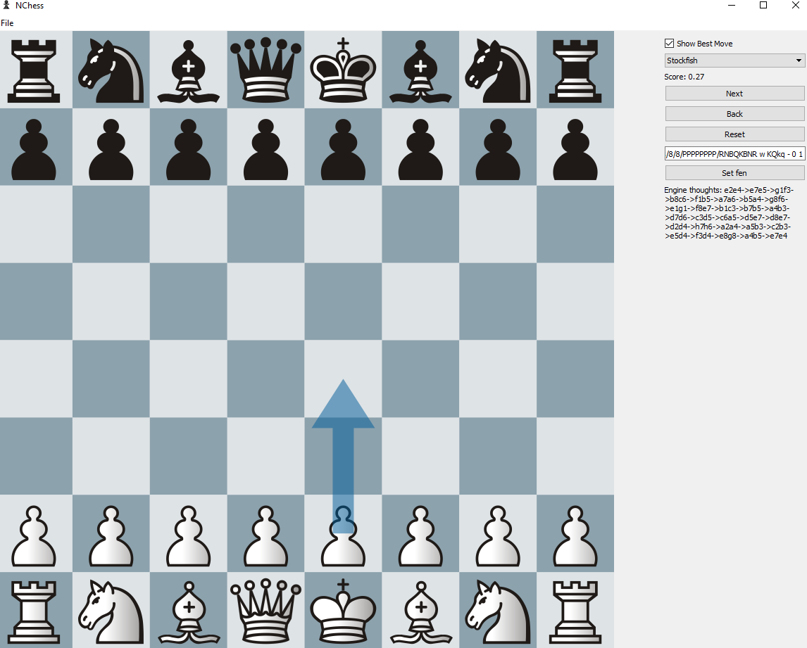

# NChess
An analysis board for chess written in python.

## Python libraries
* PyQt
* python-chess

## Engines used:
* Stockfish (https://github.com/official-stockfish/Stockfish)
* Leela (https://github.com/LeelaChessZero/lc0)
* Komodo 12 (https://komodochess.com/)

## Screenshots
